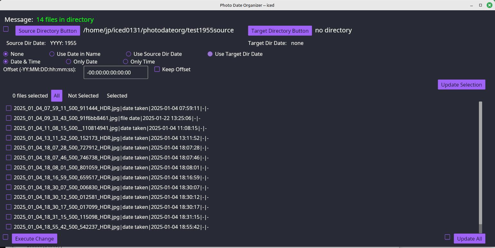

# photodateorg

Photo Date Organizer

Rust-Iced program to copy a directory of images to a target directory of target/picyyyy/picyyyymmdd and change modified date.

Each image can be customized to the desired directory.

This calls program winitsize01 to get the smallest monitor size.

